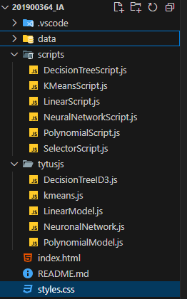

# Manual técnico

| Nombre | Carné |
| --- | --- |
| Tomas Morales | 201900364 |

---

# PLANTEAMIENTO DEL PROBLEMA

Practicar los conceptos de Machine Learning mediante el uso de la biblioteca tytus.js creando
un sitio Web con Pages de GitHub, JavaScript y HTML.

Descripción

Se debe crear un sitio Web con los siguientes componentes:
– Seleccionador de archivos de entrada del tipo CSV o DataSets.
– Seleccionador de algoritmos o modelos de Machine Learning disponibles:
– Parametrización:

o Porcentaje de train data y test data
o Objetivo del entrenamiento (tendencias, patrones, clasificación, predicción, etc.)
o Argumentos específicos para configurar la instancia del modelo
o Si fuera predicción permitir el ingreso del nuevo rango en el eje x.
o Si fuera una clasificación permitir el ingreso de la cantidad de clases.
o Si fuera un aprendizaje supervisado, la selección de las variables de entrada y de la variable de salida del DataSet.
o Cualquier otro parámetro necesario para el modelo.

– Botones para las siguientes operaciones:

o Entrenamiento
o Predicción
o Mostrar gráficas
o Cualquier otra operación necesaria.

Bibliotecas permitidas

Para la instancia de los modelos como para entrenamiento y predicción se debe utilizar la siguiente biblioteca:
[https://github.com/tytusdb/tytusjs/blob/main/dist/tytus.js](https://github.com/tytusdb/tytusjs/blob/main/dist/tytus.js)

---

# Solucion general

Se realizaron segmentaciones de scripts para poder llevar un mejor control sobre el proyecto y sus algoritmos, una vez terminado ello se definio la estructura siguiente:

Imagen que muestra el orden de las carpetas del proyecto

Cada archivo tiene segmentada la recolección de parámetros necesarios para el funcionamiento del algoritmo, una vez obtenido los parámetros se procede a utilizar la librería planteada en el proyecto luego de ello se muestra el resultado mediante una grafica en el apartado del index.

Las funciones necesitan de archivos CSV para poder llenarlos de data y para poder darles una configuracion previa, de lo contrario no funcionaran, se pede realizar el analisis de los archivos aceptados de la documentacion oficial:

 https://github.com/tytusdb/tytusjs/blob/main/dist/tytus.js

---

# Uso del sitio

Combobox para la seleccion del algoritmo

Modelo ya ajustado y valores obtenidos mostrados en apartado.

# Ejemplo de archivo ingresado

---

# Tecnologías utilizadas

- JavaScript
- HTML
- CSS